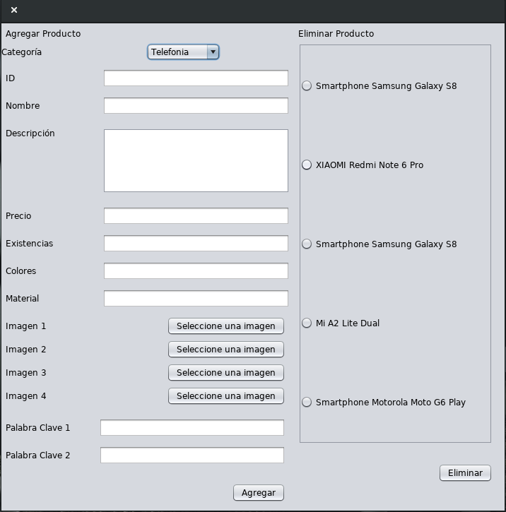
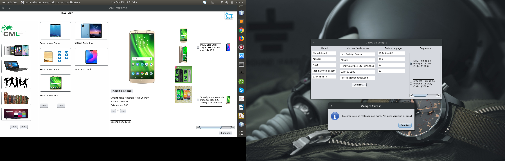

# AplicacionesParaComunicacionesDeRed
**Práctica de Tienda Vitual**

Se utiliza el envío de multiples objetos serializados
a través de la Red haciendo uso de sockets de flujo, 
con una arquitectura Cliente-Servidor.

Se almacena la información en archivos binarios haciendo
altas, bajas de los inventarios.

**Elaborado por:**

Amador Nava Miguel Ángel

Salazar Vázquez Luis Rodrigo

**Intefaz del Servidor**

**Administrador de Categorías de los Productos**

**Administrador de los Productos**

**Recibo de Compra**

**Interfaz del Cliente**

**Formulario de compra**

